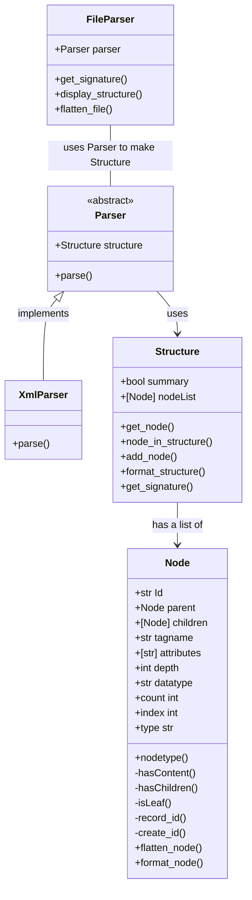

```mermaid
classDiagram
    
    class FileParser {
        +Parser parser
        +get_signature()
        +display_structure()
        +flatten_file()
    }
 
    class Parser {
        <<abstract>>
        +Structure structure
        +parse()
    }
   
   class XmlParser {
        +parse()
    }
    

    
    class Structure {
        +bool summary
        +[Node] nodeList
        +get_node()
        +node_in_structure()
        +add_node()
        +format_structure()
        +get_signature()
    }
    
    class Node {
        +str Id
        +Node parent
        +[Node] children
        +str tagname
        +[str] attributes
        +int depth
        +str datatype
        +count int
        +index int
        +type str
        
        +nodetype()
        -hasContent()
        -hasChildren()
        -isLeaf()
        -record_id()
        -create_id()
        +flatten_node()
        +format_node()
    }
    
    FileParser -- Parser : uses Parser to make Structure
    Parser <|-- XmlParser : implements
    Structure --> Node : has a list of
    Parser --> Structure : uses

            
```
    Parser --> Structure : has a
