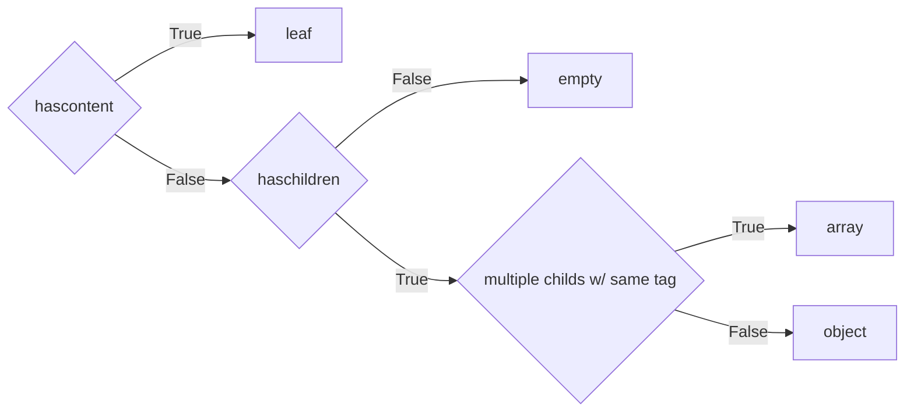
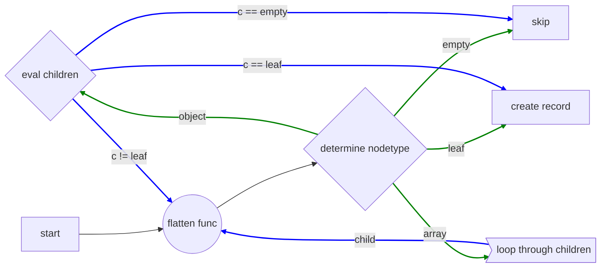

# Node Types
We identify 5 node types when parsing. The examples below work with XML:

| Type     	| hascontent 	| haschildren 	| allchildrenleafs 	| allchildrensametag 	|
|----------	|:----------:	|:-----------:	|:----------------:	|:------------------:	|
| empty    	|      ❌     	|      ❌      	|        na        	|         na         	|
| leaf     	|      ✅     	|      ❌      	|        na        	|         na         	|
| keyvalue 	|      ❌     	|      ✅      	|         ✅        |          ❌         	|
| array    	|      ❌     	|      ✅      	|         ❌        |          ✅         	|
| object   	|      ❌     	|      ✅      	|         ❌        |          ❌         	|


### Leaf
A leaf has on children and has content. 
In the example below `street` and `houseno` are leafs  
_Leafs are parsed individually_
```xml
<street>sesamestreet</street>
```
<hr>


[comment]: <> (### Keyvalue)
[comment]: <> (Has children but no content. All children are leafs but the leafs have different tags.)
[comment]: <> (In the example above `<address>` is a keyvalue object  )
[comment]: <> (_Keyvalues are parsed as a whole_)
[comment]: <> (```xml)
<!--<address>-->
<!--    <street>sesamestreet</street>-->
<!--    <houseno>1</houseno>-->
<!--</address>-->
[comment]: <> (```)
[comment]: <> (<hr>)


### Array
The node is an array when it has children that all have the same tag.  
_Parse all of these individually_
```xml
<cars>
    <car>Ferrari</car>
    <car>Lambo</car>
    <car>Porsche</car>
</cars>
```
Maybe the children with the same tags have nested values as well:
```xml
<addresses>
    <address>
        <street>sesamestreet</street>
        <houseno>1</houseno>
    </address>
    <address>
        <street>Schoolstreet</street>
        <houseno>42</houseno>
    </address>
</addresses>
```
<hr>

### Object
An object node can contains both arrays and leafs.  
_All leafs get taken, all arrays get parsed individually_
```xml
<person>
    <name>John</name>
    <age>31</age>
    <children>
        <child>childA</child>
        <child>childB</child>
    </children>
</person>
```
or 
```xml
<address>
    <street>sesamestreet</street>
    <houseno>1</houseno>
</address>
```
In the examples above the `children` will get passed individually; specific table will be created.


## Creating records
Depending on the node type records are created in a specific way. In the overview below the process is explained.


How node types get handled

If a node is of type `leaf` then we can create a record out of it. 
All children of this node will be converted to a dictionary. We can do this because both
are just leafs; a `leaf` gets translated to a dictionary with one entry; a `keyvalue` type gets
translated to a dictonary with multiple
  
If any child is an array we have to evaluate the node's children. All  